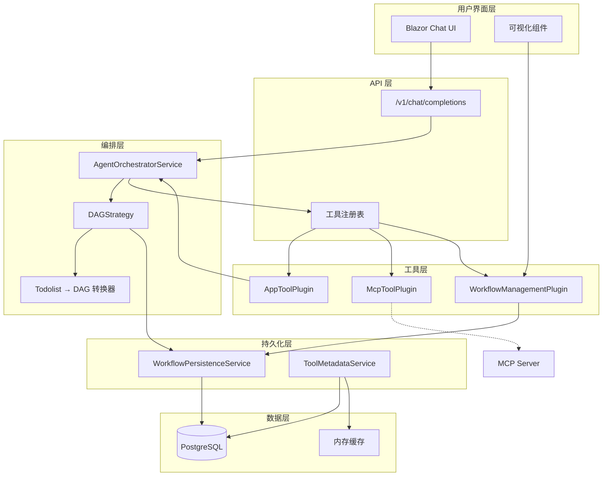
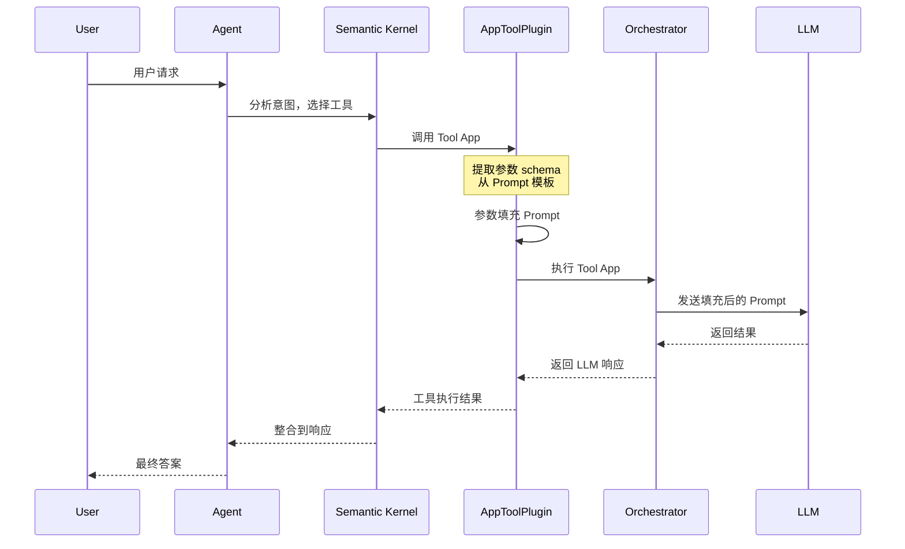
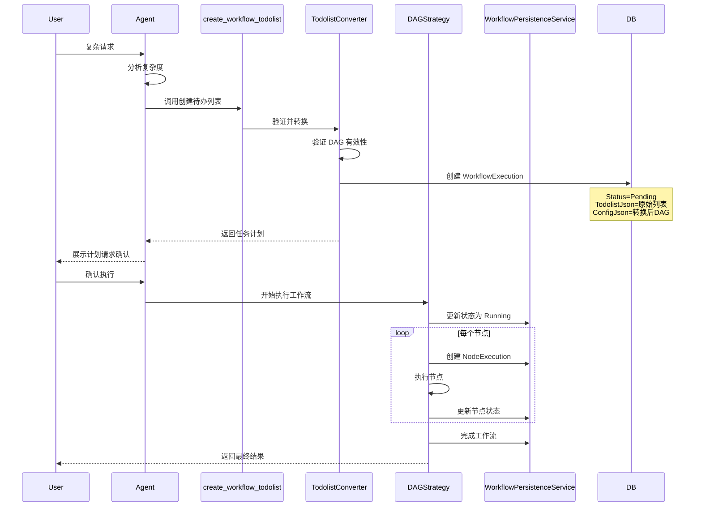

# 设计文档：DAG 工作流持久化

## 1. 概述

### 1.1 功能目标

本设计实现了三大核心创新：

1. **App 即工具（App as Tool）**：允许 LlmApp 作为可重用工具被其他 App/Agent 调用
2. **多源工具统一管理**：统一管理 App Tool 和 MCP Tool
3. **Todolist 转 DAG 执行**：将 AI 生成的待办任务列表动态转换为 DAG 工作流执行

同时实现完整的工作流持久化、可视化追踪、暂停恢复和智能任务管理。

### 1.2 技术栈

- **后端框架**：ASP.NET Core 9.0
- **ORM**：Entity Framework Core 9.0
- **数据库**：PostgreSQL 16+ (JSONB 支持)
- **AI 框架**：Semantic Kernel (Microsoft.SemanticKernel)
- **前端**：Blazor Server + AntDesign
- **可视化**：Mermaid.js, D3.js

### 1.3 设计原则

- **会话隔离**：所有工作流执行绑定到会话，确保上下文独立
- **异步持久化**：使用 fire-and-forget 模式避免阻塞执行
- **工具驱动**：所有管理操作通过 Semantic Kernel 工具调用实现
- **向后兼容**：扩展现有 DAGStrategy，不破坏已有功能
- **可扩展性**：支持未来添加新的工具类型和执行策略

---

## 2. 架构设计

### 2.1 整体架构图



### 2.2 数据流图

#### 2.2.1 App Tool 调用流程



#### 2.2.2 Todolist 转 DAG 执行流程



### 2.3 模块划分

| 模块 | 职责 | 关键类 |
|------|------|--------|
| **App Tool 模块** | Tool App 注册、参数提取、执行 | `AppToolPlugin`, `PromptParameterExtractor` |
| **工具元数据管理** | 工具扫描、缓存、发现、刷新 | `ToolMetadataService` (HybridCache) |
| **Todolist 转换模块** | 任务列表解析、DAG 转换、验证 | `TodolistConverter`, `DAGValidator`, `AgentRoleMatcher` |
| **工作流持久化模块** | 执行记录存储、状态管理 | `WorkflowPersistenceService`, `WorkflowExecution` |
| **工作流管理插件** | 8 个 SK 工具实现 | `WorkflowManagementPlugin` |
| **DAG 执行增强** | 扩展 DAGStrategy 支持持久化 | `DAGStrategy` (增强版) |
| **UI 可视化** | 执行历史、依赖图渲染 | `WorkflowVisualization.razor` |

---

## 3. 数据模型设计

### 3.1 数据库 Schema

#### 3.1.1 简化的表结构

**workflow_executions** - 工作流执行记录（所有信息集中存储）
```sql
CREATE TABLE workflow_executions (
    id UUID PRIMARY KEY DEFAULT gen_random_uuid(),
    app_id UUID NOT NULL REFERENCES llm_apps(id) ON DELETE CASCADE,
    session_id VARCHAR(100) NOT NULL,
    status VARCHAR(20) NOT NULL, -- Pending, Running, Paused, Completed, Failed, Cancelled
    started_at TIMESTAMP NOT NULL DEFAULT NOW(),
    completed_at TIMESTAMP NULL,
    
    -- 输入数据
    user_messages_json JSONB NOT NULL,
    todolist_json JSONB NULL, -- 原始待办任务列表
    
    -- 执行配置和状态
    dag_config_json JSONB NULL, -- 转换后的 DAG 配置
    node_executions_json JSONB NULL, -- 所有节点执行记录的数组
    
    -- 输出结果
    final_result TEXT NULL,
    error_message TEXT NULL,
    
    -- 元数据
    created_at TIMESTAMP NOT NULL DEFAULT NOW(),
    updated_at TIMESTAMP NOT NULL DEFAULT NOW()
);

CREATE INDEX idx_workflow_executions_session ON workflow_executions(session_id);
CREATE INDEX idx_workflow_executions_app ON workflow_executions(app_id);
CREATE INDEX idx_workflow_executions_status ON workflow_executions(status);
CREATE INDEX idx_workflow_executions_created ON workflow_executions(created_at DESC);

-- 优化：使用 GIN 索引支持 JSONB 查询
CREATE INDEX idx_workflow_executions_node_status ON workflow_executions 
    USING GIN (node_executions_json jsonb_path_ops);
```

**node_executions_json 结构示例：**
```json
[
  {
    "nodeId": "task-1",
    "agentName": "Planner",
    "agentRole": "planner",
    "agentMemberId": "member-123",
    "nodeType": "Agent",
    "status": "Completed",
    "inputMessages": [...],
    "output": "规划结果...",
    "startedAt": "2025-10-10T10:00:00Z",
    "completedAt": "2025-10-10T10:00:15Z",
    "executionOrder": 1,
    "dependencies": []
  },
  {
    "nodeId": "task-2",
    "agentName": "WebSearchTool",
    "nodeType": "ToolApp",
    "toolAppId": "app-456",
    "status": "Running",
    "startedAt": "2025-10-10T10:00:15Z",
    "executionOrder": 2,
    "dependencies": ["task-1"]
  }
]
```

#### 3.1.2 修改现有表

**llm_apps** - 添加 App Tool 支持
```sql
-- 已有字段保持不变
-- app_type 字段现在支持: "Prompt", "Tool", "Orchestrator"
-- config_json 可存储 parameterOverrides 等配置

-- 无需 ALTER，只需应用层面约定
```

**mcp_server_configs** - MCP 服务器配置（已有表）
```sql
-- 已有表，用于存储 MCP 服务器配置
-- 当配置更新时，触发工具元数据缓存刷新
```

### 3.2 C# 实体类

#### 3.2.1 WorkflowExecution.cs（简化版）

```csharp
using System.ComponentModel.DataAnnotations;
using System.ComponentModel.DataAnnotations.Schema;
using System.Text.Json;

namespace LY.LlmPool.Web.Data.Entities;

[Table("workflow_executions")]
public class WorkflowExecution
{
    [Key]
    [Column("id")]
    public Guid Id { get; set; } = Guid.NewGuid();

    [Required]
    [Column("app_id")]
    public Guid AppId { get; set; }

    [ForeignKey(nameof(AppId))]
    public virtual LlmApp? App { get; set; }

    [Required]
    [Column("session_id")]
    [MaxLength(100)]
    public string SessionId { get; set; } = string.Empty;

    [Required]
    [Column("status")]
    [MaxLength(20)]
    public WorkflowStatus Status { get; set; } = WorkflowStatus.Pending;

    [Column("started_at")]
    public DateTime StartedAt { get; set; } = DateTime.UtcNow;

    [Column("completed_at")]
    public DateTime? CompletedAt { get; set; }

    // 输入数据
    [Required]
    [Column("user_messages_json", TypeName = "jsonb")]
    public string UserMessagesJson { get; set; } = "[]";

    [Column("todolist_json", TypeName = "jsonb")]
    public string? TodolistJson { get; set; }

    // 执行配置和状态
    [Column("dag_config_json", TypeName = "jsonb")]
    public string? DagConfigJson { get; set; }

    [Column("node_executions_json", TypeName = "jsonb")]
    public string? NodeExecutionsJson { get; set; }

    // 输出结果
    [Column("final_result")]
    public string? FinalResult { get; set; }

    [Column("error_message")]
    public string? ErrorMessage { get; set; }

    // 元数据
    [Column("created_at")]
    public DateTime CreatedAt { get; set; } = DateTime.UtcNow;

    [Column("updated_at")]
    public DateTime UpdatedAt { get; set; } = DateTime.UtcNow;

    // 便捷属性
    [NotMapped]
    public List<NodeExecutionRecord> NodeExecutions
    {
        get => string.IsNullOrEmpty(NodeExecutionsJson)
            ? new List<NodeExecutionRecord>()
            : JsonSerializer.Deserialize<List<NodeExecutionRecord>>(NodeExecutionsJson) 
                ?? new List<NodeExecutionRecord>();
        set => NodeExecutionsJson = JsonSerializer.Serialize(value);
    }

    [NotMapped]
    public List<TodolistTask> Todolist
    {
        get => string.IsNullOrEmpty(TodolistJson)
            ? new List<TodolistTask>()
            : JsonSerializer.Deserialize<List<TodolistTask>>(TodolistJson) 
                ?? new List<TodolistTask>();
        set => TodolistJson = JsonSerializer.Serialize(value);
    }
}

public enum WorkflowStatus
{
    Pending,
    Running,
    Paused,
    Completed,
    Failed,
    Cancelled
}
```

#### 3.2.2 NodeExecutionRecord.cs（JSON 存储的模型）

```csharp
namespace LY.LlmPool.Web.Models;

/// <summary>
/// 节点执行记录（存储在 WorkflowExecution.NodeExecutionsJson 中）
/// </summary>
public class NodeExecutionRecord
{
    public string NodeId { get; set; } = string.Empty;
    public string AgentName { get; set; } = string.Empty;
    public string? AgentRole { get; set; }
    public string? AgentMemberId { get; set; } // 关键：记录使用的 AgentMember
    public NodeType NodeType { get; set; }
    public string? ToolAppId { get; set; }
    public NodeStatus Status { get; set; }
    public List<ChatMessage>? InputMessages { get; set; }
    public string? Result { get; set; }
    public string? ErrorMessage { get; set; }
    public DateTime? StartedAt { get; set; }
    public DateTime? CompletedAt { get; set; }
    public DateTime UpdatedAt { get; set; } = DateTime.UtcNow;
    public int ExecutionOrder { get; set; }
    public List<string> Dependencies { get; set; } = new();
}

public enum NodeType
{
    Agent,
    ToolApp
}

public enum NodeStatus
{
    Pending,
    Running,
    Completed,
    Failed,
    Skipped,
    AwaitingInput
}
```

#### 3.2.3 ToolMetadata.cs（内存缓存模型，不持久化）

```csharp
namespace LY.LlmPool.Web.Models;

/// <summary>
/// 工具元数据（存储在 HybridCache 中，不持久化到数据库）
/// </summary>
public class ToolMetadata
{
    public required string Name { get; set; }
    public string? Description { get; set; }
    public ToolSource Source { get; set; }
    public required string SourceId { get; set; } // AppId 或 McpServerId
    public Dictionary<string, object> ParametersSchema { get; set; } = new();
    public bool SupportsStreaming { get; set; }
    public bool IsEnabled { get; set; } = true;
    public DateTime RegisteredAt { get; set; } = DateTime.UtcNow;
    public DateTime UpdatedAt { get; set; } = DateTime.UtcNow;
}

public enum ToolSource
{
    App,
    MCP
}
```

### 3.3 模型类

#### 3.3.1 Todolist 相关模型

```csharp
namespace LY.LlmPool.Web.Models;

public class TodolistTask
{
    public string TaskId { get; set; } = string.Empty;
    public string Title { get; set; } = string.Empty;
    public string Description { get; set; } = string.Empty;
    public string AssignedAgentRole { get; set; } = string.Empty;
    public List<string> Dependencies { get; set; } = new();
    public string? EstimatedComplexity { get; set; } // low, medium, high
    public bool RequiresUserInput { get; set; }
    public string? ParallelGroup { get; set; }
}

public class CreateTodolistRequest
{
    public string SessionId { get; set; } = string.Empty;
    public string UserRequest { get; set; } = string.Empty;
    public string? ConversationContext { get; set; }
    public List<TodolistTask> SuggestedTasks { get; set; } = new();
}

public class CreateTodolistResponse
{
    public bool Success { get; set; }
    public Guid WorkflowExecutionId { get; set; }
    public string Message { get; set; } = string.Empty;
    public TodolistPlan Todolist { get; set; } = new();
    public string FormattedPlan { get; set; } = string.Empty;
    public List<string> ValidationWarnings { get; set; } = new();
}

public class TodolistPlan
{
    public List<TodolistTask> Tasks { get; set; } = new();
    public int TotalTasks { get; set; }
    public List<string> ParallelGroups { get; set; } = new();
    public string? EstimatedDuration { get; set; }
}
```

#### 3.3.2 DAG 转换模型

```csharp
namespace LY.LlmPool.Web.Models;

public class DAGNodeConfig
{
    public string NodeId { get; set; } = string.Empty;
    public NodeType NodeType { get; set; }
    public string? AgentMemberId { get; set; } // 对于 Agent 类型
    public Guid? ToolAppId { get; set; } // 对于 ToolApp 类型
    public List<string> Dependencies { get; set; } = new();
    public string? ParallelGroup { get; set; }
    public Dictionary<string, string>? Parameters { get; set; } // ToolApp 参数映射
}

public class ConvertedDAGConfig
{
    public List<DAGNodeConfig> Nodes { get; set; } = new();
    public Dictionary<string, List<string>> ParallelGroups { get; set; } = new();
    public List<string> ExecutionOrder { get; set; } = new();
}
```

---

## 4. 核心组件设计

### 4.1 工具元数据管理服务

#### 4.1.1 ToolMetadataService

**职责**：扫描、缓存和管理所有工具元数据（App Tool + MCP Tool）

```csharp
using Microsoft.Extensions.Caching.Hybrid;

namespace LY.LlmPool.Web.Services.Tools;

public class ToolMetadataService
{
    private readonly HybridCache _cache;
    private readonly IDbContextFactory<LlmDbContext> _dbFactory;
    private readonly PromptParameterExtractor _paramExtractor;
    private readonly ILogger<ToolMetadataService> _logger;
    
    private const string CACHE_KEY_PREFIX = "tool_metadata:";
    private const string CACHE_KEY_ALL_TOOLS = "tool_metadata:all";
    
    public ToolMetadataService(
        HybridCache cache,
        IDbContextFactory<LlmDbContext> dbFactory,
        PromptParameterExtractor paramExtractor,
        ILogger<ToolMetadataService> logger)
    {
        _cache = cache;
        _dbFactory = dbFactory;
        _paramExtractor = paramExtractor;
        _logger = logger;
    }

    /// <summary>
    /// 启动时扫描并缓存所有工具元数据
    /// </summary>
    public async Task InitializeAsync(CancellationToken cancellationToken = default)
    {
        _logger.LogInformation("Starting tool metadata initialization...");
        
        var tools = new List<ToolMetadata>();

        // 扫描 App Tools
        var appTools = await ScanAppToolsAsync();
        tools.AddRange(appTools);
        
        // 扫描 MCP Tools
        var mcpTools = await ScanMcpToolsAsync();
        tools.AddRange(mcpTools);

        // 批量缓存
        foreach (var tool in tools)
        {
            await _cache.SetAsync(
                $"{CACHE_KEY_PREFIX}{tool.Name}",
                tool,
                new HybridCacheEntryOptions
                {
                    Expiration = TimeSpan.FromHours(24),
                    LocalCacheExpiration = TimeSpan.FromMinutes(30)
                },
                cancellationToken: cancellationToken
            );
        }

        // 缓存工具列表
        await _cache.SetAsync(
            CACHE_KEY_ALL_TOOLS,
            tools,
            new HybridCacheEntryOptions
            {
                Expiration = TimeSpan.FromHours(24),
                LocalCacheExpiration = TimeSpan.FromMinutes(30)
            },
            cancellationToken: cancellationToken
        );

        _logger.LogInformation("Tool metadata initialized: {AppToolCount} App Tools, {McpToolCount} MCP Tools",
            appTools.Count, mcpTools.Count);
    }

    /// <summary>
    /// 扫描所有 Tool App
    /// </summary>
    private async Task<List<ToolMetadata>> ScanAppToolsAsync()
    {
        await using var db = await _dbFactory.CreateDbContextAsync();
        
        var toolApps = await db.LlmApps
            .Include(a => a.LlmPrompt)
            .Where(a => a.AppType == "Tool" && a.IsEnabled)
            .ToListAsync();

        var metadata = new List<ToolMetadata>();

        foreach (var app in toolApps)
        {
            try
            {
                var promptTemplate = app.LlmPrompt?.Content ?? string.Empty;
                var parameters = _paramExtractor.ExtractParameters(promptTemplate);
                
                // 应用参数覆盖
                Dictionary<string, object>? paramOverrides = null;
                if (app.Config.TryGetValue("parameterOverrides", out var overridesObj) 
                    && overridesObj is JsonElement je)
                {
                    paramOverrides = JsonSerializer.Deserialize<Dictionary<string, object>>(je.GetRawText());
                }

                var paramSchema = _paramExtractor.GenerateParameterSchema(parameters, paramOverrides);

                var toolName = app.Config.TryGetValue("toolName", out var nameObj) && nameObj is string customName 
                    ? customName 
                    : app.Name;

                var toolDescription = app.Config.TryGetValue("toolDescription", out var descObj) && descObj is string customDesc
                    ? customDesc
                    : app.Description ?? $"调用 {app.Name} 工具";

                metadata.Add(new ToolMetadata
                {
                    Name = toolName,
                    Description = toolDescription,
                    Source = ToolSource.App,
                    SourceId = app.Id!,
                    ParametersSchema = paramSchema,
                    SupportsStreaming = app.Config.TryGetValue("supportsStreaming", out var streamObj) 
                        && streamObj is bool supportsStream 
                        && supportsStream,
                    IsEnabled = app.IsEnabled,
                    RegisteredAt = DateTime.UtcNow,
                    UpdatedAt = app.UpdatedAt
                });

                _logger.LogDebug("Scanned App Tool: {ToolName} (ID: {AppId})", toolName, app.Id);
            }
            catch (Exception ex)
            {
                _logger.LogError(ex, "Failed to scan App Tool: {AppName}", app.Name);
            }
        }

        return metadata;
    }

    /// <summary>
    /// 扫描所有 MCP Tools
    /// </summary>
    private async Task<List<ToolMetadata>> ScanMcpToolsAsync()
    {
        await using var db = await _dbFactory.CreateDbContextAsync();
        
        var mcpServers = await db.McpServerConfigs
            .Where(c => c.IsEnabled)
            .ToListAsync();

        var metadata = new List<ToolMetadata>();

        foreach (var server in mcpServers)
        {
            try
            {
                // TODO: 调用 MCP SDK 获取工具列表
                // var tools = await _mcpSdkService.GetToolsAsync(server.Id);
                
                // 示例：假设 MCP Server 返回工具列表
                // foreach (var mcpTool in tools)
                // {
                //     metadata.Add(new ToolMetadata
                //     {
                //         Name = mcpTool.Name,
                //         Description = mcpTool.Description,
                //         Source = ToolSource.MCP,
                //         SourceId = server.Id,
                //         ParametersSchema = mcpTool.InputSchema,
                //         SupportsStreaming = false,
                //         IsEnabled = true
                //     });
                // }

                _logger.LogDebug("Scanned MCP Server: {ServerName}", server.Name);
            }
            catch (Exception ex)
            {
                _logger.LogError(ex, "Failed to scan MCP Server: {ServerName}", server.Name);
            }
        }

        return metadata;
    }

    /// <summary>
    /// 获取所有工具元数据
    /// </summary>
    public async Task<List<ToolMetadata>> GetAllToolsAsync(CancellationToken cancellationToken = default)
    {
        return await _cache.GetOrCreateAsync(
            CACHE_KEY_ALL_TOOLS,
            async cancel =>
            {
                _logger.LogWarning("Cache miss for all tools, re-initializing...");
                await InitializeAsync(cancel);
                
                var tools = new List<ToolMetadata>();
                tools.AddRange(await ScanAppToolsAsync());
                tools.AddRange(await ScanMcpToolsAsync());
                return tools;
            },
            cancellationToken: cancellationToken
        ) ?? new List<ToolMetadata>();
    }

    /// <summary>
    /// 根据名称获取工具元数据
    /// </summary>
    public async Task<ToolMetadata?> GetToolByNameAsync(string toolName, CancellationToken cancellationToken = default)
    {
        return await _cache.GetOrCreateAsync(
            $"{CACHE_KEY_PREFIX}{toolName}",
            async cancel =>
            {
                var allTools = await GetAllToolsAsync(cancel);
                return allTools.FirstOrDefault(t => string.Equals(t.Name, toolName, StringComparison.OrdinalIgnoreCase));
            },
            cancellationToken: cancellationToken
        );
    }

    /// <summary>
    /// 当 App 配置更新时刷新缓存
    /// </summary>
    public async Task RefreshAppToolAsync(string appId, CancellationToken cancellationToken = default)
    {
        _logger.LogInformation("Refreshing App Tool cache for App: {AppId}", appId);
        
        await using var db = await _dbFactory.CreateDbContextAsync();
        var app = await db.LlmApps
            .Include(a => a.LlmPrompt)
            .FirstOrDefaultAsync(a => a.Id == appId, cancellationToken);

        if (app == null || app.AppType != "Tool")
        {
            _logger.LogWarning("App {AppId} not found or not a Tool App", appId);
            return;
        }

        // 移除旧缓存
        var oldToolName = app.Config.TryGetValue("toolName", out var nameObj) && nameObj is string customName 
            ? customName 
            : app.Name;
        
        await _cache.RemoveAsync($"{CACHE_KEY_PREFIX}{oldToolName}", cancellationToken);

        // 扫描并缓存新数据
        var newTools = await ScanAppToolsAsync();
        var updatedTool = newTools.FirstOrDefault(t => t.SourceId == appId);

        if (updatedTool != null)
        {
            await _cache.SetAsync(
                $"{CACHE_KEY_PREFIX}{updatedTool.Name}",
                updatedTool,
                new HybridCacheEntryOptions
                {
                    Expiration = TimeSpan.FromHours(24),
                    LocalCacheExpiration = TimeSpan.FromMinutes(30)
                },
                cancellationToken: cancellationToken
            );
        }

        // 刷新全局工具列表
        await _cache.RemoveAsync(CACHE_KEY_ALL_TOOLS, cancellationToken);
        await GetAllToolsAsync(cancellationToken);

        _logger.LogInformation("App Tool cache refreshed: {ToolName}", updatedTool?.Name ?? oldToolName);
    }

    /// <summary>
    /// 当 MCP 配置更新时刷新缓存
    /// </summary>
    public async Task RefreshMcpServerAsync(string serverId, CancellationToken cancellationToken = default)
    {
        _logger.LogInformation("Refreshing MCP Server cache: {ServerId}", serverId);

        // 移除所有该 MCP Server 的工具缓存
        var allTools = await GetAllToolsAsync(cancellationToken);
        var mcpTools = allTools.Where(t => t.Source == ToolSource.MCP && t.SourceId == serverId).ToList();

        foreach (var tool in mcpTools)
        {
            await _cache.RemoveAsync($"{CACHE_KEY_PREFIX}{tool.Name}", cancellationToken);
        }

        // 刷新全局工具列表
        await _cache.RemoveAsync(CACHE_KEY_ALL_TOOLS, cancellationToken);
        await GetAllToolsAsync(cancellationToken);

        _logger.LogInformation("MCP Server cache refreshed, removed {Count} tools", mcpTools.Count);
    }
}
```

**关键特性：**

1. **HybridCache 缓存**：
   - 本地缓存 30 分钟（快速访问）
   - 分布式缓存 24 小时（跨实例共享）
   - 缓存键格式：`tool_metadata:{toolName}` 和 `tool_metadata:all`

2. **启动时初始化**：
   - 在应用启动时调用 `InitializeAsync()`
   - 扫描所有 App Tool 和 MCP Tool
   - 批量写入缓存

3. **配置更新同步**：
   - `RefreshAppToolAsync(appId)` - App 更新时调用
   - `RefreshMcpServerAsync(serverId)` - MCP 配置更新时调用
   - 自动移除旧缓存并重新扫描

4. **容错机制**：
   - 扫描单个工具失败不影响其他工具
   - Cache miss 时自动重新初始化
   - 详细的日志记录

---

### 4.2 App Tool 模块

#### 4.2.1 PromptParameterExtractor

**职责**：从 Prompt 模板中提取参数占位符

```csharp
namespace LY.LlmPool.Web.Services.Tools;

public class PromptParameterExtractor
{
    private static readonly Regex _parameterRegex = new(@"\{\{([a-zA-Z_][a-zA-Z0-9_.]*)\}\}", RegexOptions.Compiled);

    public List<string> ExtractParameters(string promptTemplate)
    {
        var matches = _parameterRegex.Matches(promptTemplate);
        return matches
            .Select(m => m.Groups[1].Value)
            .Distinct()
            .ToList();
    }

    public Dictionary<string, object> GenerateParameterSchema(List<string> parameters, Dictionary<string, object>? overrides = null)
    {
        var properties = new Dictionary<string, object>();
        var required = new List<string>();

        foreach (var param in parameters)
        {
            // 默认类型为 string
            var paramSchema = new Dictionary<string, object>
            {
                ["type"] = "string",
                ["description"] = $"从 Prompt 模板自动提取的参数: {param}"
            };

            // 应用用户覆盖
            if (overrides?.TryGetValue(param, out var overrideObj) == true && overrideObj is Dictionary<string, object> overrideDict)
            {
                foreach (var (key, value) in overrideDict)
                {
                    paramSchema[key] = value;
                }

                // 检查是否必填
                if (overrideDict.TryGetValue("required", out var reqObj) && reqObj is bool isRequired && isRequired)
                {
                    required.Add(param);
                }
            }
            else
            {
                // 默认必填
                required.Add(param);
            }

            properties[param] = paramSchema;
        }

        return new Dictionary<string, object>
        {
            ["type"] = "object",
            ["properties"] = properties,
            ["required"] = required
        };
    }

    public string RenderPrompt(string template, Dictionary<string, object> parameters)
    {
        var result = template;
        foreach (var (key, value) in parameters)
        {
            var placeholder = $"{{{{{key}}}}}";
            result = result.Replace(placeholder, value?.ToString() ?? string.Empty);
        }
        return result;
    }
}
```

#### 4.2.2 AppToolPlugin

**职责**：将 Tool App 注册为 Semantic Kernel 工具

```csharp
using Microsoft.SemanticKernel;
using System.ComponentModel;

namespace LY.LlmPool.Web.Services.Tools;

public class AppToolPlugin
{
    private readonly IServiceProvider _serviceProvider;
    private readonly PromptParameterExtractor _parameterExtractor;
    private readonly ILogger<AppToolPlugin> _logger;

    public AppToolPlugin(
        IServiceProvider serviceProvider,
        PromptParameterExtractor parameterExtractor,
        ILogger<AppToolPlugin> logger)
    {
        _serviceProvider = serviceProvider;
        _parameterExtractor = parameterExtractor;
        _logger = logger;
    }

    /// <summary>
    /// 动态注册 Tool App 到 Kernel
    /// </summary>
    public void RegisterToolApp(Kernel kernel, LlmApp toolApp)
    {
        if (toolApp.AppType != "Tool" || !toolApp.IsEnabled)
        {
            return;
        }

        // 提取参数
        var promptTemplate = toolApp.LlmPrompt?.Content ?? string.Empty;
        var parameters = _parameterExtractor.ExtractParameters(promptTemplate);

        // 应用用户覆盖
        Dictionary<string, object>? paramOverrides = null;
        if (toolApp.Config.TryGetValue("parameterOverrides", out var overridesObj) && overridesObj is JsonElement je)
        {
            paramOverrides = JsonSerializer.Deserialize<Dictionary<string, object>>(je.GetRawText());
        }

        var paramSchema = _parameterExtractor.GenerateParameterSchema(parameters, paramOverrides);

        // 创建 KernelFunction
        var toolName = toolApp.Config.TryGetValue("toolName", out var nameObj) && nameObj is string customName 
            ? customName 
            : toolApp.Name;

        var toolDescription = toolApp.Config.TryGetValue("toolDescription", out var descObj) && descObj is string customDesc
            ? customDesc
            : toolApp.Description ?? $"调用 {toolApp.Name} 工具";

        // 注册为 Kernel Function
        kernel.Plugins.AddFromFunctions(toolName, new[]
        {
            kernel.CreateFunctionFromMethod(
                async (KernelArguments args) => await ExecuteToolAppAsync(toolApp, args),
                toolName,
                toolDescription,
                parameters.Select(p => new KernelParameterMetadata(p)).ToList()
            )
        });

        _logger.LogInformation("Registered Tool App: {ToolName} with {ParamCount} parameters", toolName, parameters.Count);
    }

    private async Task<string> ExecuteToolAppAsync(LlmApp toolApp, KernelArguments arguments)
    {
        using var scope = _serviceProvider.CreateScope();
        var orchestrator = scope.ServiceProvider.GetRequiredService<AgentOrchestratorService>();
        var dbFactory = scope.ServiceProvider.GetRequiredService<IDbContextFactory<LlmDbContext>>();

        // 加载完整的 App 数据
        await using var db = await dbFactory.CreateDbContextAsync();
        var app = await db.LlmApps
            .Include(a => a.LlmPrompt)
            .Include(a => a.LlmConfig)
            .FirstOrDefaultAsync(a => a.Id == toolApp.Id);

        if (app == null || app.LlmPrompt == null)
        {
            throw new InvalidOperationException($"Tool App {toolApp.Name} not found or missing prompt");
        }

        // 渲染 Prompt
        var promptTemplate = app.LlmPrompt.Content;
        var parameters = arguments.ToDictionary(kvp => kvp.Key, kvp => kvp.Value ?? string.Empty);
        var renderedPrompt = _parameterExtractor.RenderPrompt(promptTemplate, parameters);

        // 执行 LLM 推理
        var userMessage = new ChatMessage { Role = "user", Content = renderedPrompt };
        var result = await orchestrator.ExecuteAsync(
            app,
            new[] { userMessage },
            sessionId: Guid.NewGuid().ToString(), // Tool App 执行使用独立 session
            streaming: false
        );

        return result;
    }
}
```

### 4.3 Todolist 转换模块

#### 4.3.1 任务映射策略

**核心问题**：如何让 AI 生成的 `assignedAgentRole` 准确映射到 `AgentMember`？

**解决方案：三级匹配策略**

```csharp
namespace LY.LlmPool.Web.Services.Workflow;

public class AgentRoleMatcher
{
    private readonly ILogger<AgentRoleMatcher> _logger;

    public AgentRoleMatcher(ILogger<AgentRoleMatcher> logger)
    {
        _logger = logger;
    }

    /// <summary>
    /// 三级匹配策略：精确匹配 → 角色匹配 → 语义匹配
    /// </summary>
    public (AgentMember? member, MatchType matchType) FindMatchingAgent(
        string assignedAgentRole,
        IEnumerable<AgentMember> availableAgents)
    {
        var agents = availableAgents.ToList();

        // Level 1: 精确名称匹配（大小写不敏感）
        var exactMatch = agents.FirstOrDefault(a => 
            string.Equals(a.Name, assignedAgentRole, StringComparison.OrdinalIgnoreCase));
        
        if (exactMatch != null)
        {
            _logger.LogInformation("Exact name match: {Role} → {Agent}", assignedAgentRole, exactMatch.Name);
            return (exactMatch, MatchType.ExactName);
        }

        // Level 2: 角色匹配（Role 字段）
        var roleMatch = agents.FirstOrDefault(a => 
            !string.IsNullOrEmpty(a.Role) && 
            string.Equals(a.Role, assignedAgentRole, StringComparison.OrdinalIgnoreCase));
        
        if (roleMatch != null)
        {
            _logger.LogInformation("Role match: {Role} → {Agent}", assignedAgentRole, roleMatch.Name);
            return (roleMatch, MatchType.RoleField);
        }

        // Level 3: 模糊/语义匹配（基于关键词）
        var fuzzyMatch = FindFuzzyMatch(assignedAgentRole, agents);
        if (fuzzyMatch != null)
        {
            _logger.LogInformation("Fuzzy match: {Role} → {Agent}", assignedAgentRole, fuzzyMatch.Name);
            return (fuzzyMatch, MatchType.Fuzzy);
        }

        // Level 4: 降级到第一个可用 Agent（仅在单 Agent 时）
        if (agents.Count == 1)
        {
            _logger.LogWarning("Fallback to single agent: {Role} → {Agent}", assignedAgentRole, agents[0].Name);
            return (agents[0], MatchType.Fallback);
        }

        _logger.LogError("No match found for role: {Role}", assignedAgentRole);
        return (null, MatchType.None);
    }

    private AgentMember? FindFuzzyMatch(string roleDescription, List<AgentMember> agents)
    {
        // 关键词映射表
        var keywords = new Dictionary<string, string[]>(StringComparer.OrdinalIgnoreCase)
        {
            ["planner"] = new[] { "plan", "规划", "planning", "organizer" },
            ["researcher"] = new[] { "research", "搜索", "search", "investigator", "finder" },
            ["analyst"] = new[] { "analysis", "分析", "analyzer", "evaluator" },
            ["summarizer"] = new[] { "summary", "总结", "conclude", "reporter" },
            ["coder"] = new[] { "code", "编程", "programming", "developer" },
            ["reviewer"] = new[] { "review", "审核", "check", "validator" }
        };

        var roleLower = roleDescription.ToLowerInvariant();

        foreach (var agent in agents)
        {
            var agentRole = (agent.Role ?? agent.Name).ToLowerInvariant();

            // 检查 Agent 的 Role 是否在关键词表中
            foreach (var (standardRole, synonyms) in keywords)
            {
                if (agentRole.Contains(standardRole) || synonyms.Any(s => agentRole.Contains(s)))
                {
                    // 检查任务角色是否匹配这个标准角色
                    if (roleLower.Contains(standardRole) || synonyms.Any(s => roleLower.Contains(s)))
                    {
                        return agent;
                    }
                }
            }
        }

        return null;
    }
}

public enum MatchType
{
    None,
    ExactName,
    RoleField,
    Fuzzy,
    Fallback
}
```

**使用示例：**

```csharp
// AI 生成的任务
var task = new TodolistTask 
{ 
    TaskId = "task-1",
    AssignedAgentRole = "搜索专家"  // AI 的自由描述
};

// App 中配置的 AgentMembers
var members = new List<AgentMember>
{
    new() { Name = "WebSearcher", Role = "researcher" },
    new() { Name = "DataAnalyzer", Role = "analyst" }
};

// 匹配
var matcher = new AgentRoleMatcher(logger);
var (matchedAgent, matchType) = matcher.FindMatchingAgent(task.AssignedAgentRole, members);

// 结果: matchedAgent = WebSearcher (通过 Fuzzy 匹配 "搜索" → "research")
```

#### 4.3.2 增强的 Prompt 提示

为了提高匹配成功率，在调用 `create_workflow_todolist` 工具时，向 LLM 提供可用的 Agent 列表：

```csharp
public async Task<string> GetToolPromptEnhancement(LlmApp app)
{
    var availableAgents = app.AgentMembers
        .Select(m => new { m.Name, m.Role })
        .ToList();

    var availableTools = await GetAvailableToolApps();

    return $@"
可用的 Agents（在分配任务时优先使用这些名称或角色）:
{string.Join("\n", availableAgents.Select(a => $"- {a.Name} (角色: {a.Role ?? "未指定"})"))}

可用的 Tool Apps:
{string.Join("\n", availableTools.Select(t => $"- {t.Name} (类型: Tool App)"))}

在创建待办任务时:
1. assignedAgentRole 应该使用上述 Agent 的 Name 或 Role
2. 如果需要调用工具，使用 Tool App 的名称
3. 如果没有完全匹配，系统会尝试模糊匹配
";
}
```

#### 4.3.3 TodolistConverter（更新版）

```csharp
namespace LY.LlmPool.Web.Services.Workflow;

public class TodolistConverter
{
    private readonly IDbContextFactory<LlmDbContext> _dbFactory;
    private readonly DAGValidator _validator;
    private readonly AgentRoleMatcher _matcher;
    private readonly ILogger<TodolistConverter> _logger;

    public TodolistConverter(
        IDbContextFactory<LlmDbContext> dbFactory,
        DAGValidator validator,
        AgentRoleMatcher matcher,
        ILogger<TodolistConverter> logger)
    {
        _dbFactory = dbFactory;
        _validator = validator;
        _matcher = matcher;
        _logger = logger;
    }

    public async Task<(ConvertedDAGConfig? dagConfig, List<string> errors, List<string> warnings)> ConvertTodolistToDAGAsync(
        List<TodolistTask> tasks,
        LlmApp app)
    {
        var errors = new List<string>();
        var warnings = new List<string>();
        var nodes = new List<DAGNodeConfig>();
        var parallelGroups = new Dictionary<string, List<string>>();

        // 加载 Tool Apps
        await using var db = await _dbFactory.CreateDbContextAsync();
        var toolApps = await db.LlmApps
            .Where(a => a.AppType == "Tool" && a.IsEnabled)
            .ToDictionaryAsync(a => a.Name, a => a, StringComparer.OrdinalIgnoreCase);

        foreach (var task in tasks)
        {
            var nodeConfig = new DAGNodeConfig
            {
                NodeId = task.TaskId,
                Dependencies = task.Dependencies,
                ParallelGroup = task.ParallelGroup
            };

            // 首先尝试匹配 Tool App
            if (toolApps.TryGetValue(task.AssignedAgentRole, out var toolApp))
            {
                nodeConfig.NodeType = NodeType.ToolApp;
                nodeConfig.ToolAppId = Guid.Parse(toolApp.Id!);
                nodeConfig.ToolAppName = toolApp.Name;
                
                _logger.LogInformation("Mapped task {TaskId} to Tool App: {ToolApp}", 
                    task.TaskId, toolApp.Name);
            }
            // 然后尝试匹配 AgentMember
            else
            {
                var (matchedAgent, matchType) = _matcher.FindMatchingAgent(
                    task.AssignedAgentRole,
                    app.AgentMembers);

                if (matchedAgent != null)
                {
                    nodeConfig.NodeType = NodeType.Agent;
                    nodeConfig.AgentMemberId = matchedAgent.Id;
                    nodeConfig.AgentName = matchedAgent.Name;
                    nodeConfig.AgentRole = matchedAgent.Role;

                    // 如果是模糊匹配或降级匹配，添加警告
                    if (matchType == MatchType.Fuzzy)
                    {
                        warnings.Add($"任务 '{task.TaskId}' 使用模糊匹配: '{task.AssignedAgentRole}' → Agent '{matchedAgent.Name}'");
                    }
                    else if (matchType == MatchType.Fallback)
                    {
                        warnings.Add($"任务 '{task.TaskId}' 使用降级匹配（仅单个 Agent）: '{task.AssignedAgentRole}' → '{matchedAgent.Name}'");
                    }

                    _logger.LogInformation("Mapped task {TaskId} to Agent: {Agent} (match type: {MatchType})", 
                        task.TaskId, matchedAgent.Name, matchType);
                }
                else
                {
                    errors.Add($"任务 '{task.TaskId}' 的 assignedAgentRole '{task.AssignedAgentRole}' 无法映射到任何 Agent 或 Tool App");
                    continue;
                }
            }

            nodes.Add(nodeConfig);

            // 收集并行组
            if (!string.IsNullOrEmpty(task.ParallelGroup))
            {
                if (!parallelGroups.ContainsKey(task.ParallelGroup))
                {
                    parallelGroups[task.ParallelGroup] = new List<string>();
                }
                parallelGroups[task.ParallelGroup].Add(task.TaskId);
            }
        }

        if (errors.Any())
        {
            return (null, errors, warnings);
        }

        // 验证 DAG
        var (isValid, validationErrors, executionOrder) = _validator.ValidateDAG(
            nodes.Select(n => n.NodeId).ToList(),
            nodes.ToDictionary(n => n.NodeId, n => n.Dependencies)
        );

        if (!isValid)
        {
            errors.AddRange(validationErrors);
            return (null, errors, warnings);
        }

        var dagConfig = new ConvertedDAGConfig
        {
            Nodes = nodes,
            ParallelGroups = parallelGroups,
            ExecutionOrder = executionOrder
        };

        return (dagConfig, errors, warnings);
    }
}
```

#### 4.3.4 DAGNodeConfig（更新）

```csharp
namespace LY.LlmPool.Web.Models;

public class DAGNodeConfig
{
    public string NodeId { get; set; } = string.Empty;
    public NodeType NodeType { get; set; }
    
    // 对于 Agent 类型
    public string? AgentMemberId { get; set; }
    public string? AgentName { get; set; }
    public string? AgentRole { get; set; }
    
    // 对于 ToolApp 类型
    public Guid? ToolAppId { get; set; }
    public string? ToolAppName { get; set; }
    
    // 共同字段
    public List<string> Dependencies { get; set; } = new();
    public string? ParallelGroup { get; set; }
    public Dictionary<string, string>? Parameters { get; set; } // ToolApp 参数映射
}
```

---

### 4.4 匹配策略总结

| 匹配级别 | 匹配方式 | 示例 | 置信度 |
|----------|----------|------|--------|
| **Level 1** | 精确名称匹配 | "Planner" → AgentMember.Name="Planner" | 🟢 高 |
| **Level 2** | 角色字段匹配 | "planner" → AgentMember.Role="planner" | 🟢 高 |
| **Level 3** | 模糊/关键词匹配 | "搜索专家" → AgentMember.Role="researcher" | 🟡 中 |
| **Level 4** | 单 Agent 降级 | 任何描述 → 唯一的 AgentMember | 🔴 低 |

**最佳实践建议：**

1. **在系统提示中列出可用 Agent**：让 LLM 知道有哪些 Agent 可用
2. **使用标准化角色名称**：planner, researcher, analyst, summarizer 等
3. **AgentMember.Role 字段要明确**：与任务分配的角色保持一致
4. **返回匹配警告**：让用户知道使用了模糊匹配

---

### 4.5 DAG 验证模块

#### 4.5.1 DAGValidator

```csharp
namespace LY.LlmPool.Web.Services.Workflow;

public class DAGValidator
{
    public (bool isValid, List<string> errors, List<string> sortedNodes) ValidateDAG(
        List<string> nodeIds,
        Dictionary<string, List<string>> dependencies)
    {
        var errors = new List<string>();

        // 检查依赖是否存在
        foreach (var (nodeId, deps) in dependencies)
        {
            foreach (var dep in deps)
            {
                if (!nodeIds.Contains(dep))
                {
                    errors.Add($"任务 '{nodeId}' 依赖于不存在的任务 '{dep}'");
                }
            }
        }

        if (errors.Any())
        {
            return (false, errors, new List<string>());
        }

        // 拓扑排序检测循环
        var sortedNodes = TopologicalSort(nodeIds, dependencies, out var hasCycle, out var cycleNodes);

        if (hasCycle)
        {
            errors.Add($"检测到循环依赖: {string.Join(" → ", cycleNodes)}");
            return (false, errors, new List<string>());
        }

        return (true, errors, sortedNodes);
    }

    private List<string> TopologicalSort(
        List<string> nodeIds,
        Dictionary<string, List<string>> dependencies,
        out bool hasCycle,
        out List<string> cycleNodes)
    {
        var inDegree = nodeIds.ToDictionary(id => id, id => 0);
        var graph = nodeIds.ToDictionary(id => id, id => new List<string>());

        // 构建图和入度
        foreach (var (nodeId, deps) in dependencies)
        {
            foreach (var dep in deps)
            {
                graph[dep].Add(nodeId);
                inDegree[nodeId]++;
            }
        }

        // Kahn 算法
        var queue = new Queue<string>(inDegree.Where(kvp => kvp.Value == 0).Select(kvp => kvp.Key));
        var sorted = new List<string>();

        while (queue.Count > 0)
        {
            var current = queue.Dequeue();
            sorted.Add(current);

            foreach (var neighbor in graph[current])
            {
                inDegree[neighbor]--;
                if (inDegree[neighbor] == 0)
                {
                    queue.Enqueue(neighbor);
                }
            }
        }

        hasCycle = sorted.Count != nodeIds.Count;
        cycleNodes = hasCycle ? inDegree.Where(kvp => kvp.Value > 0).Select(kvp => kvp.Key).ToList() : new List<string>();

        return sorted;
    }
}
```

---

### 4.6 工作流持久化服务

#### 4.6.1 WorkflowPersistenceService

**设计原则：**
- Fire-and-forget 异步持久化（不阻塞 DAG 执行）
- 操作 JSONB 数组（无独立的 NodeExecution 表）
- 支持原生 PostgreSQL JSONB 查询
- 事务保证批量操作的一致性

```csharp
namespace LY.LlmPool.Web.Services.Workflow;

public class WorkflowPersistenceService
{
    private readonly IDbContextFactory<LlmDbContext> _dbFactory;
    private readonly ILogger<WorkflowPersistenceService> _logger;

    public WorkflowPersistenceService(
        IDbContextFactory<LlmDbContext> dbFactory,
        ILogger<WorkflowPersistenceService> logger)
    {
        _dbFactory = dbFactory;
        _logger = logger;
    }

    /// <summary>
    /// 创建工作流执行记录（异步，不阻塞调用线程）
    /// </summary>
    public void CreateWorkflowExecutionAsync(
        Guid appId,
        string sessionId,
        List<TodolistTask> todolist,
        ConvertedDAGConfig dagConfig,
        List<string> userMessages)
    {
        _ = Task.Run(async () =>
        {
            try
            {
                await using var db = await _dbFactory.CreateDbContextAsync();

                var execution = new WorkflowExecution
                {
                    Id = Guid.NewGuid(),
                    AppId = appId,
                    SessionId = sessionId,
                    Status = WorkflowStatus.Pending,
                    
                    // 存储原始 Todolist
                    TodolistJson = JsonSerializer.Serialize(todolist, new JsonSerializerOptions
                    {
                        PropertyNamingPolicy = JsonNamingPolicy.CamelCase
                    }),
                    
                    // 存储转换后的 DAG 配置
                    DagConfigJson = JsonSerializer.Serialize(dagConfig, new JsonSerializerOptions
                    {
                        PropertyNamingPolicy = JsonNamingPolicy.CamelCase
                    }),
                    
                    // 用户消息
                    UserMessagesJson = JsonSerializer.Serialize(userMessages, new JsonSerializerOptions
                    {
                        PropertyNamingPolicy = JsonNamingPolicy.CamelCase
                    }),
                    
                    // 初始化节点执行记录（所有节点状态为 Pending）
                    NodeExecutionsJson = JsonSerializer.Serialize(
                        dagConfig.Nodes.Select(node => new NodeExecutionRecord
                        {
                            NodeId = node.NodeId,
                            AgentMemberId = node.AgentMemberId,
                            AgentName = node.AgentName,
                            ToolAppId = node.ToolAppId?.ToString(),
                            NodeType = node.NodeType,
                            Status = NodeStatus.Pending,
                            Dependencies = node.Dependencies,
                            ExecutionOrder = dagConfig.ExecutionOrder.IndexOf(node.NodeId)
                        }).ToList(),
                        new JsonSerializerOptions
                        {
                            PropertyNamingPolicy = JsonNamingPolicy.CamelCase
                        }
                    ),
                    
                    CreatedAt = DateTime.UtcNow,
                    UpdatedAt = DateTime.UtcNow
                };

                db.WorkflowExecutions.Add(execution);
                await db.SaveChangesAsync();

                _logger.LogInformation("Created workflow execution {ExecutionId} for session {SessionId}",
                    execution.Id, sessionId);
            }
            catch (Exception ex)
            {
                _logger.LogError(ex, "Failed to create workflow execution for session {SessionId}", sessionId);
            }
        });
    }

    /// <summary>
    /// 更新工作流状态
    /// </summary>
    public async Task UpdateWorkflowStatusAsync(
        Guid executionId,
        WorkflowStatus status,
        DateTime? completedAt = null,
        string? errorMessage = null,
        string? finalResult = null)
    {
        await using var db = await _dbFactory.CreateDbContextAsync();

        var execution = await db.WorkflowExecutions.FindAsync(executionId);
        if (execution == null)
        {
            _logger.LogWarning("Workflow execution {ExecutionId} not found", executionId);
            return;
        }

        execution.Status = status;
        execution.UpdatedAt = DateTime.UtcNow;

        if (completedAt.HasValue)
            execution.CompletedAt = completedAt;

        if (!string.IsNullOrEmpty(errorMessage))
            execution.ErrorMessage = errorMessage;

        if (!string.IsNullOrEmpty(finalResult))
            execution.FinalResult = finalResult;

        await db.SaveChangesAsync();
    }

    /// <summary>
    /// 更新节点执行状态（操作 JSONB 数组）
    /// </summary>
    public async Task UpdateNodeStatusAsync(
        Guid executionId,
        string nodeId,
        NodeStatus status,
        string? result = null,
        string? errorMessage = null,
        DateTime? startedAt = null,
        DateTime? completedAt = null)
    {
        await using var db = await _dbFactory.CreateDbContextAsync();

        var execution = await db.WorkflowExecutions.FindAsync(executionId);
        if (execution == null)
        {
            _logger.LogWarning("Workflow execution {ExecutionId} not found", executionId);
            return;
        }

        // 反序列化节点执行记录
        var nodeExecutions = execution.NodeExecutions;
        var nodeRecord = nodeExecutions.FirstOrDefault(n => n.NodeId == nodeId);
        
        if (nodeRecord == null)
        {
            _logger.LogWarning("Node {NodeId} not found in execution {ExecutionId}", nodeId, executionId);
            return;
        }

        // 更新节点状态
        nodeRecord.Status = status;
        nodeRecord.UpdatedAt = DateTime.UtcNow;

        if (!string.IsNullOrEmpty(result))
            nodeRecord.Result = result;

        if (!string.IsNullOrEmpty(errorMessage))
            nodeRecord.ErrorMessage = errorMessage;

        if (startedAt.HasValue)
            nodeRecord.StartedAt = startedAt;

        if (completedAt.HasValue)
            nodeRecord.CompletedAt = completedAt;

        // 序列化回 JSONB
        execution.NodeExecutions = nodeExecutions;
        execution.UpdatedAt = DateTime.UtcNow;

        await db.SaveChangesAsync();

        _logger.LogInformation("Updated node {NodeId} status to {Status} in execution {ExecutionId}",
            nodeId, status, executionId);
    }

    /// <summary>
    /// 获取工作流执行历史（支持 JSONB 查询）
    /// </summary>
    public async Task<List<WorkflowExecution>> GetWorkflowHistoryAsync(
        string? sessionId = null,
        WorkflowStatus? status = null,
        int skip = 0,
        int take = 20)
    {
        await using var db = await _dbFactory.CreateDbContextAsync();

        var query = db.WorkflowExecutions.AsQueryable();

        if (!string.IsNullOrEmpty(sessionId))
            query = query.Where(e => e.SessionId == sessionId);

        if (status.HasValue)
            query = query.Where(e => e.Status == status);

        return await query
            .OrderByDescending(e => e.CreatedAt)
            .Skip(skip)
            .Take(take)
            .ToListAsync();
    }

    /// <summary>
    /// 获取工作流详细信息
    /// </summary>
    public async Task<WorkflowExecution?> GetWorkflowDetailsAsync(Guid executionId)
    {
        await using var db = await _dbFactory.CreateDbContextAsync();
        return await db.WorkflowExecutions.FindAsync(executionId);
    }

    /// <summary>
    /// 使用 PostgreSQL JSONB 查询功能查找特定状态的节点
    /// </summary>
    public async Task<List<NodeExecutionRecord>> GetNodesByStatusAsync(
        Guid executionId,
        NodeStatus status)
    {
        await using var db = await _dbFactory.CreateDbContextAsync();

        var execution = await db.WorkflowExecutions
            .FromSqlRaw(@"
                SELECT * FROM workflow_executions
                WHERE id = {0}
                AND node_executions_json @> '[{{""status"": ""{1}""}}]'::jsonb
            ", executionId, status.ToString())
            .FirstOrDefaultAsync();

        if (execution == null)
            return new List<NodeExecutionRecord>();

        return execution.NodeExecutions
            .Where(n => n.Status == status)
            .ToList();
    }

    /// <summary>
    /// 批量更新节点状态（事务）
    /// </summary>
    public async Task<BatchUpdateResult> BatchUpdateNodeStatusAsync(
        Guid executionId,
        List<(string NodeId, NodeStatus Status)> updates)
    {
        await using var db = await _dbFactory.CreateDbContextAsync();
        await using var transaction = await db.Database.BeginTransactionAsync();

        try
        {
            var execution = await db.WorkflowExecutions.FindAsync(executionId);
            if (execution == null)
            {
                _logger.LogWarning("Workflow execution {ExecutionId} not found", executionId);
                return new BatchUpdateResult { Success = false, ErrorMessage = "Workflow not found" };
            }

            var nodeExecutions = execution.NodeExecutions;
            var updatedCount = 0;

            foreach (var (nodeId, newStatus) in updates)
            {
                var node = nodeExecutions.FirstOrDefault(n => n.NodeId == nodeId);
                if (node != null)
                {
                    node.Status = newStatus;
                    node.UpdatedAt = DateTime.UtcNow;
                    updatedCount++;
                }
            }

            execution.NodeExecutions = nodeExecutions;
            execution.UpdatedAt = DateTime.UtcNow;

            await db.SaveChangesAsync();
            await transaction.CommitAsync();

            _logger.LogInformation("Batch updated {Count} nodes in execution {ExecutionId}",
                updatedCount, executionId);

            return new BatchUpdateResult { Success = true, UpdatedCount = updatedCount };
        }
        catch (Exception ex)
        {
            await transaction.RollbackAsync();
            _logger.LogError(ex, "Failed to batch update nodes in execution {ExecutionId}", executionId);
            return new BatchUpdateResult { Success = false, ErrorMessage = ex.Message };
        }
    }
}

public class BatchUpdateResult
{
    public bool Success { get; set; }
    public int UpdatedCount { get; set; }
    public string? ErrorMessage { get; set; }
}
```

**关键点：**

1. **JSONB 操作**：
   - `NodeExecutions` 属性自动处理序列化/反序列化（通过 EF 拦截器或 getter/setter）
   - EF Core 自动将更改同步到 `NodeExecutionsJson` 字段

2. **原生 SQL 查询**：
   ```sql
   -- 查找包含特定状态节点的工作流
   SELECT * FROM workflow_executions
   WHERE node_executions_json @> '[{"status": "Running"}]'::jsonb;
   ```

3. **事务支持**：
   - 批量更新使用事务保证一致性
   - 失败时自动回滚

4. **性能优化**：
   - 单次查询获取完整工作流（无 JOIN）
   - GIN 索引加速 JSONB 查询
   - 减少数据库往返次数

---


### 4.7 工作流管理插件

#### 4.7.1 WorkflowManagementPlugin

**完整的 8 个工具实现**

```csharp
using Microsoft.SemanticKernel;
using System.ComponentModel;

namespace LY.LlmPool.Web.Services.Plugins;

public class WorkflowManagementPlugin
{
    private readonly WorkflowPersistenceService _persistence;
    private readonly TodolistConverter _converter;
    private readonly ILogger<WorkflowManagementPlugin> _logger;

    public WorkflowManagementPlugin(
        WorkflowPersistenceService persistence,
        TodolistConverter converter,
        ILogger<WorkflowManagementPlugin> logger)
    {
        _persistence = persistence;
        _converter = converter;
        _logger = logger;
    }

    [KernelFunction("create_workflow_todolist")]
    [Description("基于用户请求创建工作流待办任务列表")]
    public async Task<CreateTodolistResponse> CreateWorkflowTodolistAsync(
        [Description("当前会话 ID")] string sessionId,
        [Description("用户的原始请求")] string userRequest,
        [Description("建议的任务列表")] List<TodolistTask> suggestedTasks)
    {
        // 实现在下文详述
        throw new NotImplementedException();
    }

    [KernelFunction("get_workflow_history")]
    [Description("查询工作流执行历史")]
    public async Task<object> GetWorkflowHistoryAsync(
        [Description("会话 ID（可选）")] string? sessionId = null,
        [Description("应用 ID（可选）")] string? appId = null,
        [Description("状态过滤（可选）")] string? status = null,
        [Description("最大结果数")] int limit = 10,
        [Description("分页偏移量")] int offset = 0)
    {
        var statusEnum = status != null ? Enum.Parse<WorkflowStatus>(status, true) : (WorkflowStatus?)null;
        var appGuid = appId != null ? Guid.Parse(appId) : (Guid?)null;

        var executions = await _persistence.GetWorkflowHistoryAsync(sessionId, appGuid, statusEnum, limit, offset);

        return new
        {
            executions = executions.Select(e => new
            {
                id = e.Id,
                appName = e.App?.Name,
                status = e.Status.ToString(),
                startedAt = e.StartedAt,
                completedAt = e.CompletedAt,
                nodeCount = new
                {
                    total = e.NodeExecutions.Count,
                    completed = e.NodeExecutions.Count(n => n.Status == NodeExecutionStatus.Completed),
                    failed = e.NodeExecutions.Count(n => n.Status == NodeExecutionStatus.Failed),
                    running = e.NodeExecutions.Count(n => n.Status == NodeExecutionStatus.Running),
                    pending = e.NodeExecutions.Count(n => n.Status == NodeExecutionStatus.Pending)
                },
                duration = e.CompletedAt.HasValue ? (e.CompletedAt.Value - e.StartedAt).ToString(@"hh\:mm\:ss") : null
            }),
            total = executions.Count
        };
    }

    // 其他 6 个工具的实现...
    // get_workflow_details, get_dependency_graph, pause_workflow, resume_workflow, retry_failed_nodes, modify_workflow_tasks
}
```

---

## 5. 错误处理策略

### 5.1 错误分类

| 错误类型 | 处理策略 | 示例 |
|----------|----------|------|
| **验证错误** | 返回清晰错误消息，不创建记录 | Todolist 包含循环依赖 |
| **映射错误** | 提示无法映射的角色，停止转换 | AgentRole 未找到匹配 |
| **执行错误** | 记录到 NodeExecution.ErrorMessage，标记 Failed | LLM 调用超时 |
| **持久化错误** | 记录日志，不影响执行流程 | 数据库暂时不可用 |

### 5.2 错误恢复机制

```csharp
public class WorkflowErrorHandler
{
    public async Task<bool> HandleNodeFailureAsync(
        NodeExecution node,
        Exception ex,
        DAGWorkflowConfig dagConfig)
    {
        _logger.LogError(ex, "Node {NodeId} failed", node.NodeId);

        await _persistence.UpdateNodeStatusAsync(
            node.Id,
            NodeExecutionStatus.Failed,
            errorMessage: ex.Message
        );

        // 根据失败策略决定是否继续
        if (dagConfig.FailureStrategy == "StopAll")
        {
            return false; // 停止整个工作流
        }

        return true; // 继续执行其他节点
    }
}
```

---

## 6. 测试策略

### 6.1 单元测试

**覆盖范围：**
- PromptParameterExtractor: 参数提取、Schema 生成、Prompt 渲染
- DAGValidator: 循环检测、拓扑排序
- TodolistConverter: 任务映射、DAG 转换

**测试示例：**
```csharp
[Fact]
public void ExtractParameters_ShouldFindAllPlaceholders()
{
    var extractor = new PromptParameterExtractor();
    var template = "Search for {{query}} with limit {{maxResults}} in {{category}}";
    
    var parameters = extractor.ExtractParameters(template);
    
    Assert.Equal(3, parameters.Count);
    Assert.Contains("query", parameters);
    Assert.Contains("maxResults", parameters);
    Assert.Contains("category", parameters);
}

[Fact]
public void ValidateDAG_ShouldDetectCycle()
{
    var validator = new DAGValidator();
    var nodes = new List<string> { "A", "B", "C" };
    var dependencies = new Dictionary<string, List<string>>
    {
        ["A"] = new List<string> { "B" },
        ["B"] = new List<string> { "C" },
        ["C"] = new List<string> { "A" } // Cycle!
    };

    var (isValid, errors, _) = validator.ValidateDAG(nodes, dependencies);

    Assert.False(isValid);
    Assert.Contains("循环依赖", errors[0]);
}
```

### 6.2 集成测试

**测试场景：**
1. App Tool 端到端调用
2. Todolist 创建 → DAG 转换 → 执行
3. 工作流暂停/恢复
4. 节点失败重试

**测试示例：**
```csharp
[Fact]
public async Task CreateTodolist_ShouldConvertToDAG_AndExecute()
{
    // Arrange
    var app = await CreateTestAppWithAgents();
    var tasks = new List<TodolistTask>
    {
        new() { TaskId = "task-1", AssignedAgentRole = "planner", Dependencies = new() },
        new() { TaskId = "task-2", AssignedAgentRole = "researcher", Dependencies = new() { "task-1" } }
    };

    // Act
    var response = await _plugin.CreateWorkflowTodolistAsync("test-session", "Test request", tasks);

    // Assert
    Assert.True(response.Success);
    Assert.Equal(2, response.Todolist.TotalTasks);

    // Verify DAG execution
    var execution = await _dbContext.WorkflowExecutions.FindAsync(response.WorkflowExecutionId);
    Assert.NotNull(execution);
    Assert.Equal(WorkflowStatus.Pending, execution.Status);
}
```

### 6.3 性能测试

**基准测试：**
- 工作流执行开销 < 10% (相比无持久化版本)
- 100 节点 DAG 转换 < 500ms
- 并发 10 个工作流不阻塞

---

## 7. 部署考虑

### 7.1 应用启动配置

**Program.cs 初始化工具元数据缓存：**

```csharp
// 注册 HybridCache
builder.Services.AddHybridCache(options =>
{
    options.MaximumPayloadBytes = 1024 * 1024; // 1 MB
    options.MaximumKeyLength = 1024;
    options.DefaultEntryOptions = new HybridCacheEntryOptions
    {
        Expiration = TimeSpan.FromHours(24),
        LocalCacheExpiration = TimeSpan.FromMinutes(30)
    };
});

// 注册服务
builder.Services.AddScoped<ToolMetadataService>();
builder.Services.AddScoped<PromptParameterExtractor>();
builder.Services.AddScoped<AgentRoleMatcher>();
builder.Services.AddScoped<TodolistConverter>();
builder.Services.AddScoped<DAGValidator>();
builder.Services.AddScoped<WorkflowPersistenceService>();

// 应用启动时初始化工具缓存
var app = builder.Build();

// 初始化工具元数据
using (var scope = app.Services.CreateScope())
{
    var toolMetadataService = scope.ServiceProvider.GetRequiredService<ToolMetadataService>();
    await toolMetadataService.InitializeAsync();
}

app.Run();
```

**监听配置更新事件：**

```csharp
// 在 LlmApp 更新时刷新缓存
public class LlmAppUpdateHandler : INotificationHandler<LlmAppUpdatedNotification>
{
    private readonly ToolMetadataService _toolMetadataService;

    public async Task Handle(LlmAppUpdatedNotification notification, CancellationToken cancellationToken)
    {
        if (notification.App.AppType == "Tool")
        {
            await _toolMetadataService.RefreshAppToolAsync(notification.App.Id!, cancellationToken);
        }
    }
}

// 在 MCP 配置更新时刷新缓存
public class McpConfigUpdateHandler : INotificationHandler<McpConfigUpdatedNotification>
{
    private readonly ToolMetadataService _toolMetadataService;

    public async Task Handle(McpConfigUpdatedNotification notification, CancellationToken cancellationToken)
    {
        await _toolMetadataService.RefreshMcpServerAsync(notification.ServerId, cancellationToken);
    }
}
```

### 7.2 数据库迁移

**EF Core 迁移命令：**
```bash
dotnet ef migrations add AddWorkflowPersistence --project src/LY.LlmPool.Web
dotnet ef database update --project src/LY.LlmPool.Web
```

### 7.2 数据库迁移

**EF Core 迁移命令：**
```bash
dotnet ef migrations add AddWorkflowPersistence --project src/LY.LlmPool.Web
dotnet ef database update --project src/LY.LlmPool.Web
```

**注意**：本次迁移只涉及 `workflow_executions` 表，不包含 `tool_metadata` 表（已改用 HybridCache）

### 7.3 配置项

**appsettings.json 新增配置：**
```json
{
  "Workflow": {
    "EnablePersistence": true,
    "DefaultRetentionDays": 30,
    "MaxNodeOutputSize": 10485760,
    "EnableRealtimeUpdates": true,
    "UpdatePollingIntervalMs": 2000
  },
  "ToolManagement": {
    "EnableAppTools": true,
    "EnableMcpTools": true,
    "AutoRegisterToolApps": true,
    "ToolDiscoveryCacheDuration": 300
  }
}
```

### 7.3 配置项

**appsettings.json 新增配置：**
```json
{
  "HybridCache": {
    "MaximumPayloadBytes": 1048576,
    "MaximumKeyLength": 1024,
    "DefaultExpirationHours": 24,
    "LocalCacheExpirationMinutes": 30
  },
  "Workflow": {
    "EnablePersistence": true,
    "DefaultRetentionDays": 30,
    "MaxNodeOutputSize": 10485760,
    "EnableRealtimeUpdates": true,
    "UpdatePollingIntervalMs": 2000
  },
  "ToolManagement": {
    "EnableAppTools": true,
    "EnableMcpTools": true,
    "AutoInitializeOnStartup": true,
    "AutoRefreshOnConfigChange": true
  }
}
```

### 7.4 监控指标

**关键指标：**
- `workflow_executions_total` - 工作流总数
- `workflow_execution_duration_seconds` - 执行时长
- `node_execution_failures_total` - 节点失败次数
- `tool_app_invocations_total` - Tool App 调用次数
- `tool_metadata_cache_hits_total` - 工具元数据缓存命中次数
- `tool_metadata_cache_misses_total` - 工具元数据缓存未命中次数
- `tool_metadata_refresh_total` - 工具元数据刷新次数

---

## 8. 设计决策记录

### 8.1 为什么使用 Fire-and-Forget 持久化？

**决策**：WorkflowExecution 创建使用异步 fire-and-forget 模式

**理由**：
- 避免阻塞工作流执行
- 数据库不可用时不影响核心功能
- 持久化是辅助功能，不应成为瓶颈

**权衡**：可能丢失少量执行记录（极端情况）

### 8.2 为什么参数从 Prompt 模板提取？

**决策**：Tool App 参数自动从 Prompt 模板的 `{{参数}}` 占位符提取

**理由**：
- 减少配置重复（Prompt 已定义参数）
- 确保工具 Schema 与实际 Prompt 一致
- 简化 Tool App 创建流程

**权衡**：需要解析模板，增加轻微开销

### 8.3 为什么 Todolist 转 DAG 而不是直接执行？

**决策**：将 Todolist 转换为 DAG 结构后使用现有 DAGStrategy 执行

**理由**：
- 复用已有的 DAGStrategy 成熟代码
- 支持依赖关系和并行执行
- 便于可视化和管理

**权衡**：增加一层转换逻辑

### 8.4 为什么使用 JSONB 存储节点执行记录？

**决策**：移除独立的 `node_executions` 表，改用 `workflow_executions.node_executions_json` (JSONB 数组)

**理由**：
- **性能优化**：单次查询获取完整工作流（无需 JOIN）
- **减少复杂度**：简化 EF 配置和关系管理
- **灵活性**：JSONB 支持动态字段，便于 Schema 演进
- **PostgreSQL 优势**：GIN 索引提供高效查询能力

**权衡**：
- 失去关系数据库的外键约束
- 需要在应用层面验证数据完整性
- 查询语法相对复杂（需要使用 JSONB 运算符）

**实现细节**：
```csharp
// EF 实体使用 NotMapped 属性提供强类型访问
[NotMapped]
public List<NodeExecutionRecord> NodeExecutions
{
    get => JsonSerializer.Deserialize<List<NodeExecutionRecord>>(NodeExecutionsJson);
    set => NodeExecutionsJson = JsonSerializer.Serialize(value);
}
```

### 8.5 为什么使用三级任务映射策略？

**决策**：AgentRoleMatcher 使用 精确名称匹配 → 角色字段匹配 → 关键词模糊匹配 的三级策略

**理由**：
- **精确匹配优先**：当 Agent 名称明确时，直接使用（最高置信度）
- **角色匹配兜底**：利用 AgentMember.Role 字段提供标准化映射
- **模糊匹配容错**：处理 AI 生成的自由描述（如"搜索专家" → "researcher"）
- **降级机制**：单 Agent 场景下避免失败（低置信度，记录警告）

**权衡**：
- 模糊匹配可能不准确（需要警告机制）
- 关键词表需要维护（planner, researcher, analyst 等）

**最佳实践**：
```csharp
// 在系统提示中列出可用 Agent，引导 LLM 使用正确名称
var prompt = $@"
可用的 Agents:
- Planner (角色: planner)
- Researcher (角色: researcher)

在创建待办任务时，请使用上述名称或角色";
```

### 8.6 为什么使用 HybridCache 而不是数据库表存储工具元数据？

**决策**：移除 `tool_metadata` 表，改用 `HybridCache` 缓存工具元数据

**理由**：
- **性能优化**：避免每次调用工具时查询数据库
- **简化架构**：减少一张表，降低数据库维护成本
- **实时性**：配置更新后立即刷新缓存，无需担心数据同步
- **分布式友好**：HybridCache 支持跨实例共享（Redis 等）

**权衡**：
- 应用重启时需要重新扫描（启动时间稍长）
- 缓存可能失效（通过 Cache miss 自动重建）

**实现细节**：
- 启动时调用 `ToolMetadataService.InitializeAsync()` 扫描所有工具
- App/MCP 配置更新时调用 `RefreshAppToolAsync()` / `RefreshMcpServerAsync()`
- HybridCache 配置：本地缓存 30 分钟 + 分布式缓存 24 小时

**优势对比**：
```
数据库存储：
  + 持久化，重启不丢失
  - 每次查询都要访问数据库
  - 需要同步 App/MCP 配置变更

HybridCache 存储：
  + 极快的访问速度（内存级别）
  + 配置更新立即生效
  + 跨实例共享（分布式缓存）
  - 应用重启需要重新扫描（可接受的启动成本）
```

---

## 9. 下一步行动

### 9.1 实现优先级

**P0 (必须)**：
1. 数据库 Schema 和实体类
2. WorkflowPersistenceService 基础功能
3. PromptParameterExtractor 和 AppToolPlugin
4. TodolistConverter 和 DAGValidator
5. WorkflowManagementPlugin (8 个工具)

**P1 (重要)**：
6. DAGStrategy 集成持久化
7. UI 可视化组件
8. 完整测试套件

**P2 (可选)**：
9. 实时进度更新 (SSE)
10. 高级分析仪表板

### 9.2 风险点

| 风险 | 缓解措施 |
|------|----------|
| Semantic Kernel 版本兼容性 | 使用稳定 API，避免 Proposed APIs |
| 大规模 DAG 性能 | 限制最大节点数 (100)，添加超时 |
| 数据库写入压力 | 批量写入，异步持久化 |
| Prompt 模板解析错误 | 严格正则验证，提供降级方案 |

---

**文档版本**：1.0  
**创建日期**：2025-10-10  
**作者**：AI Assistant  
**审核状态**：待审核
